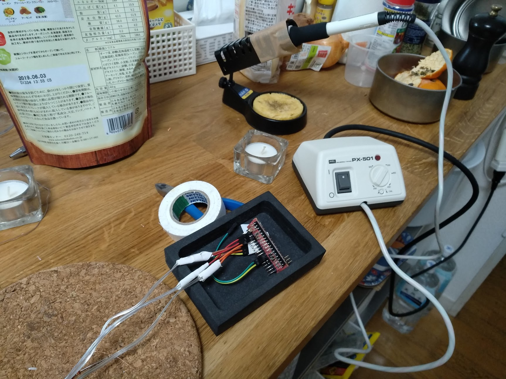

## Christmas lights
A very quick hack as julpyssel.
<iframe src="https://www.youtube.com/embed/2vVJAMOSDZU"> </iframe>

*  Get a few battery powered festive leds in Akihabara
*  Measure  current and find it was low enough to be driven by a gpio
*  Ad a arduino from the project.
*  PWM on a few ports.

