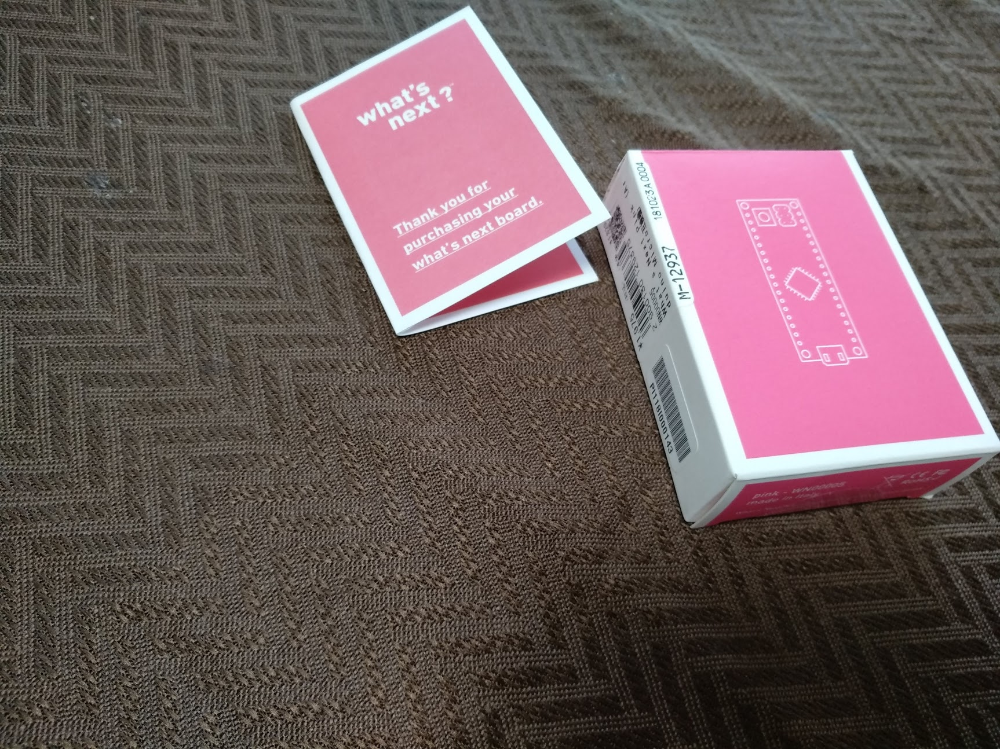
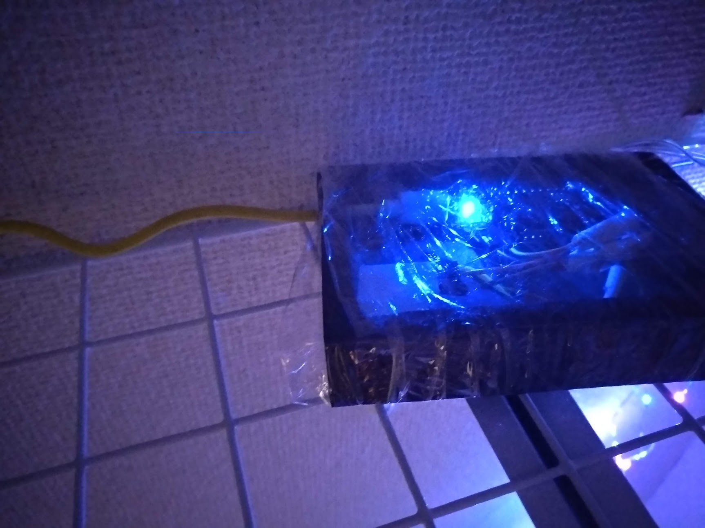

## Christmas lights

A very quick hack as julpyssel. <a href="https://github.com/simonsso/christmas_lights">Source Code at github</a>

<iframe width="500" height="500" src="https://www.youtube.com/embed/2vVJAMOSDZU"> </iframe>
<iframe width="500" height="500" src="https://www.youtube.com/embed/G65ORBAF9l4"> </iframe>

*  Get a few battery powered festive leds in Akihabara
*  Measure  current and find it was low enough to be driven by a gpio
*  Ad a arduino from the project.
*  PWM on a few ports.

