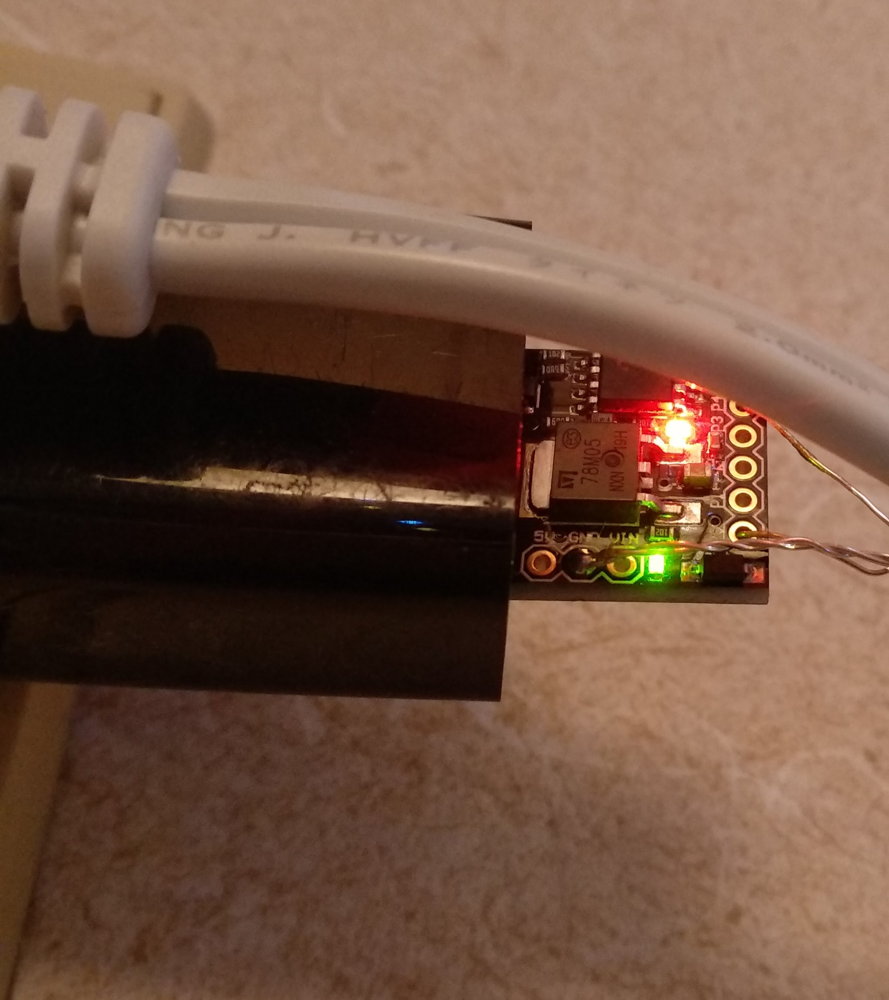

## Christmas lights

A very quick hack as julpyssel. Source code available for two implementions [Arduino code](https://github.com/simonsso/christmas_lights) and 
[rust version for digispark at85tiny](https://github.com/simonsso/rust_christmas_lights)
<iframe width="500" height="500" src="https://www.youtube.com/embed/2vVJAMOSDZU"> </iframe>
<iframe width="500" height="500" src="https://www.youtube.com/embed/G65ORBAF9l4"> </iframe>

*  Get a few battery powered christmas leds in Akihabara
*  Measure  current and find it was low enough to be driven by a gpio
*  Ad a arduino from the project.
*  PWM on a few ports.
*  A few years later deploy a new batch with the ATtiny85 digispark arduino platform and reimplement in [Rust](https://github.com/simonsso/rust_christmas_lights)

### First version

### 2022 upgraded hardware

